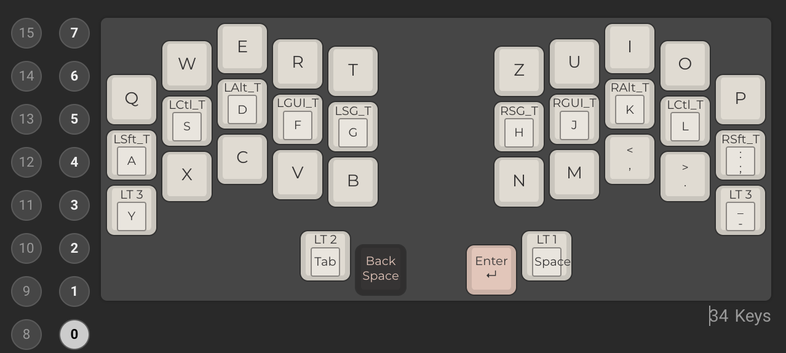
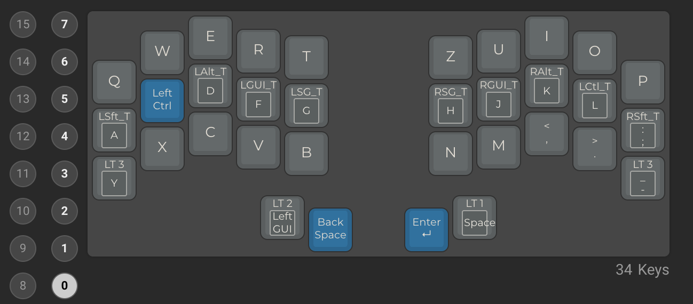
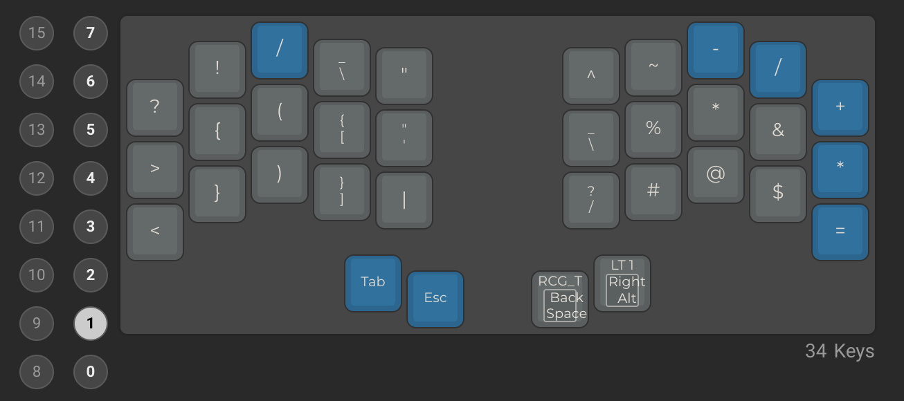
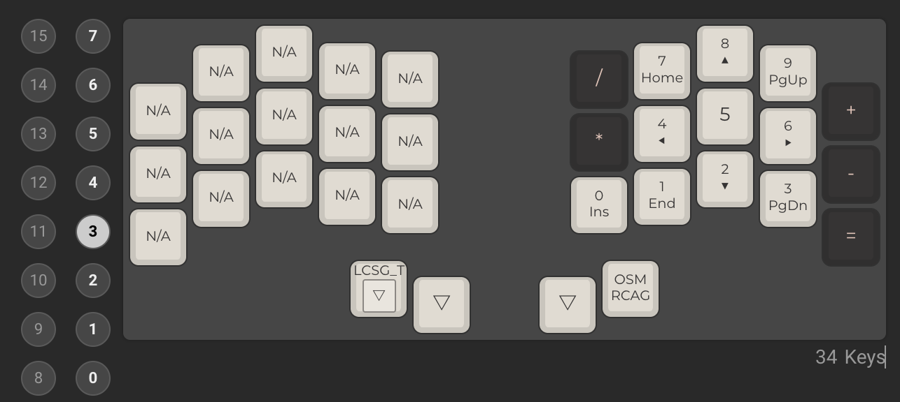

# Ferris Sweep — personal keymap

A QMK keymap for the [Ferris sweep](https://github.com/davidphilipbarr/Sweep) (34-key split keyboard, `LAYOUT_split_3x5_2`). Includes German Umlauts (ä/ö/ü/ß and Ä/Ö/Ü) plus backslash, designed to work on **macOS with the standard "U.S." keyboard layout** — no OS-side input source changes needed.

This repo is **fully self-contained**: it vendors the QMK firmware tree, so you can rebuild years from now even if QMK disappears from the internet.

## Layout

### Layer 0 — base


### Layer 1 — symbols


### Layer 2 — nav / media / F-keys


### Layer 3 — numpad + Umlauts


(Layers 4–7 exist in `keymap.c` but aren't pictured.)

## How the Umlauts work

Your OS is set to the standard US English layout, so keycodes can't directly send `ä`. Instead, each Umlaut is a **custom keycode** that fires a small key sequence using macOS's built-in Option dead keys:

| Key | Sequence sent | Result |
|---|---|---|
| `CK_AE` | `Option+u`, then `a` | ä |
| `CK_OE` | `Option+u`, then `o` | ö |
| `CK_UE` | `Option+u`, then `u` | ü |
| `CK_SS` | `Option+s` | ß |
| `CK_AE_U` | `Option+u`, then `Shift+a` | Ä |
| `CK_OE_U` | `Option+u`, then `Shift+o` | Ö |
| `CK_UE_U` | `Option+u`, then `Shift+u` | Ü |

Implemented in `keymap.c` via `process_record_user` + `SEND_STRING(SS_LALT("u") "a")`. **macOS-only** — Linux/Windows would need a different approach (Compose key, WinCompose, or QMK Unicode Hex Input).

`\` is just `KC_BSLS` — no special handling needed.

## Repo layout

```
FerrisSweep/
├── keymap.c                ← your layout + Umlaut macros (the source of truth)
├── rules.mk                ← per-keymap build flags
├── keymap.json.reference   ← QMK Configurator-importable copy (not used at compile time)
├── compile.sh              ← builds the firmware (see below)
├── .gitignore              ← excludes *.hex and qmk_firmware/.build/
├── Layer{0..3}.png         ← layout screenshots
├── README.md               ← this file
└── qmk_firmware/           ← vendored full QMK tree (~166 MB)
```

## Building the firmware

Prerequisite: the QMK CLI installed on your machine.
```
brew install qmk/qmk/qmk
```

Then from the repo root:
```
./compile.sh
```

This will:
1. Sync `keymap.c` + `rules.mk` into `qmk_firmware/keyboards/ferris/keymaps/3_layer_problem/`
2. Run `qmk compile -kb ferris/sweep -km 3_layer_problem`
3. Copy the resulting `ferris_sweep_3_layer_problem.hex` back to the repo root

> **Run** the script — don't `source` it. Sourcing in zsh breaks because `BASH_SOURCE` isn't set, and `qmk compile` only becomes available once `QMK_HOME` points at a valid QMK tree.

By default `compile.sh` uses the vendored `./qmk_firmware`. To build against a different QMK checkout:
```
QMK_HOME=/path/to/other/qmk_firmware ./compile.sh
```

## Flashing

The Ferris sweep uses an `atmega32u4` ProMicro. Put each half into bootloader mode (double-tap the reset button, or short the reset pin) and flash with QMK Toolbox, `dfu-programmer`, or:
```
qmk flash ferris_sweep_3_layer_problem.hex
```
Both halves run the same firmware — flash each half separately.

## Modifying the keymap

Edit `keymap.c`. The 8 layers are defined as `LAYOUT_split_3x5_2(...)` blocks, each taking 34 keycodes in this order:

```
top-row    left 5 ,  right 5
home-row   left 5 ,  right 5
bot-row    left 5 ,  right 5
thumbs     left 2 ,  right 2
```

To use any of the Umlaut keycodes, just drop `CK_AE` / `CK_OE` / `CK_UE` / `CK_SS` / `CK_AE_U` / `CK_OE_U` / `CK_UE_U` into a slot. Then:
```
./compile.sh
```
…and flash.

## Why QMK is vendored

`./qmk_firmware/` is a full copy of the QMK firmware tree at the version this keymap was last verified against. Vendoring (vs. cloning fresh or using a submodule) means:

- The repo builds offline, forever, even if QMK is taken down or breaks compatibility.
- No surprise rebuilds caused by upstream changes.
- Trade-off: the repo is large (~166 MB) and you don't get upstream bug fixes automatically.

To update QMK in the future, replace `./qmk_firmware/` with a fresh clone, run `./compile.sh`, and verify nothing broke.

## Build size

Roughly **20 KB / 28 KB** of program flash used (~69%, leaving ~9 KB headroom for combos, tap dance, more layers, etc.).
